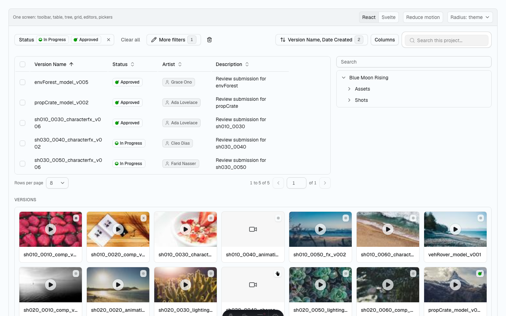

# sg-widgets

shadcn-compatible widgets for Flow Production Tracking (ShotGrid), for React and Svelte. Entity
pickers, tables, trees, filter editors and field editors install into your app as source, on a
headless core that encodes what the REST API answers.



## Install

One command installs every item of a registry.

```sh
pnpm dlx shadcn@latest add https://sg-widgets.vercel.app/r/react/sg-widgets.json
pnpm dlx shadcn-svelte@latest add https://sg-widgets.vercel.app/r/svelte/sg-widgets.json
```

Every item names `sg-widgets-core` and `add` installs it. An app that draws its own components
takes the core on its own:

```sh
pnpm add sg-widgets-core
```

[The docs site](https://sg-widgets.vercel.app) has a page per widget, a live demo in both
frameworks, and the rest of the install.

## Packages

| package | what |
|---|---|
| `packages/core` | `sg-widgets-core`: headless TypeScript. Field data types and operator vocabularies, filter tree to `api3_hash`, status logic, client adapter. No framework, no dependencies. |
| `packages/react` | shadcn registry on Base UI. Installed into your app with `shadcn add`. |
| `packages/svelte` | shadcn-svelte registry on Bits UI, Svelte 5. Installed with `shadcn-svelte add`. |
| `apps/site` | Astro + Starlight docs, live demos of both frameworks side by side, and the static registry JSON under `/r/react` and `/r/svelte`. |

The behaviour the core encodes comes from [sg-groundtruth](https://github.com/ksallee/sg-groundtruth),
a recorded corpus of what the REST API actually does.

## Develop

    pnpm install
    pnpm test              # core unit tests
    pnpm check             # typecheck every package
    pnpm registry:build    # emit registry JSON into apps/site/public/r
    pnpm dev:site          # docs and demos

Every widget lands in core first (model, tests), then Svelte, then React. A widget is done when both
frameworks have it.

## Status

First release. The set is complete and documented, and the API behaviour behind it is measured
rather than guessed. What a widget gets wrong, what a page leaves out and what your site does that
this does not expect are all worth an issue.

## Licence

[MIT](LICENSE).
